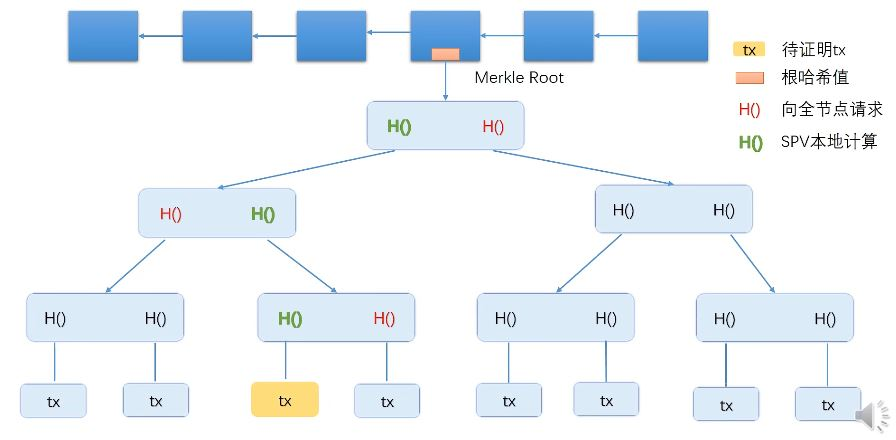

# 比特币的数据结构

## 术语

- hash pointer 哈希指针
- tamper-evident lock 防篡改锁

## 哈希指针

普通指针存储的是某个结构体在内存中的地址，而哈希指针除了存储地址之外，还存储了该结构体的哈希值，这样能够判断结构体中的内容有没有发生变化，哈希指针一般用 `H()` 表示。

## 区块链

最左边的区块是系统产生的第一个区块，称为 genesis block；最右边的区块是最后产生的区块，称为 most recent block。区块链与普通链表一个大的区别就是用哈希指针替代了普通指针，从第二个块开始，每一个区块都包含指向上一个区块的哈希指针，most recent block 也有一个指向它的哈希指针，保存在系统中。

通过哈希指针组成的区块链可以实现 tamper-evident lock，任意区块发生了变化都会影响指向它的哈希指针，从而影响最后一个哈希指针。到这一步就能看出，普通链表修改任意节点都不会影响其他节点，而区块链牵一发而动全身。有了这个特性，比特币中有些节点就不用保存整条区块链，只在需要的时候请求其他节点即可。

## Merkle Tree

最下面一层是数据块，上面的内部节点都是哈希指针。根节点也有一个指向它的哈希指针，称为 root hash。与区块链类似，由哈希指针组成的 merkle tree 也具备 tamper-evident lock，任意数据块发生变化都会导致 root hash 发生变化。

区块链中各个区块用哈希指针连接在一起，每个区块都分成 block header 和 block body，block body 中的交易内容组织成一棵 merkle tree，block header 存储这颗树的 root hash。

比特币中的节点分为全节点和轻节点，全节点保存了整个区块的内容，而轻节点只保存了 block header，全节点想要向轻节点证明某个交易已经写进了区块中，可以提供 merkle proof：

黄色块即本次交易存储的数据块，黄色数据块一直往上直到根节点的路径形成一个 merkle proof。全节点向轻节点证明时，只需要将图中红色的哈希值发给轻节点即可。
